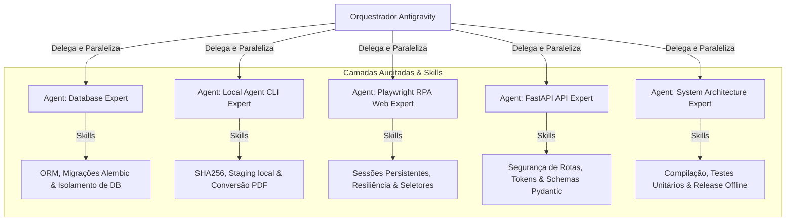

# 🤖 Stellantis Automation HUB - Catálogo de Agentes e Skills

Este documento é o registro oficial e o guia de referência dos **Agentes de IA Especializados** e de suas respectivas **Skills (Habilidades)** criados para atuar na auditoria, manutenção, segurança e evolução contínua do **Automation HUB**.

Esses agentes operam de forma paralela e coordenada sob a regência do orquestrador principal (**Antigravity**), possuindo permissões e escopos focados para garantir máxima qualidade técnica e isolamento no ciclo de desenvolvimento.

---

## 🛠️ Catálogo de Agentes e Definições de Skills

Abaixo estão detalhados a finalidade, as diretrizes de sistema (*system prompts*), a árvore de competências técnicas (*skills*) e o relatório gerado por cada agente especializado.

---

### 1. 📊 Database Expert (Especialista em Banco de Dados)
*   **Finalidade:** Análise profunda da modelagem relacional, gerenciamento de migrações estruturadas no Alembic e validação de isolamento de bases SQLite/PostgreSQL.
*   **Diretório de Atuação:** `backend/app/db/`, `backend/app/models/` e `backend/alembic/`.
*   **Skills Principais:**
    *   **Dual-Environment Security:** Capacidade de verificar o isolamento das chamadas assíncronas concorrentes via `ContextVar` para manter dados do desenvolvedor 100% apartados do banco operacional.
    *   **Alembic Auto-Migration:** Auditoria de geração de scripts de migração automatizados compatíveis com múltiplos dialetos de bancos de dados.
    *   **Batch Alteration Resiliency:** Habilidade em converter alterações de restrições em SQLite local utilizando `with op.batch_alter_table(...)` sem corromper schemas ativos.
*   **Relatório Técnico Gerado:**
    *   📄 [database_audit_report.md](file:///C:/Users/Edinh/.gemini/antigravity-cli/brain/22cb2e62-1b80-49b6-85e0-d1d05f7d875c/database_audit_report.md)

---

### 2. 📁 Local Agent CLI Expert (Especialista em CLI e Monitoramento)
*   **Finalidade:** Garantir o correto funcionamento do script do agente local, do agendamento em background, do staging temporário e da integridade física de arquivos.
*   **Diretório de Atuação:** `backend/app/cli/` e `backend/app/services/automation_staging.py`.
*   **Skills Principais:**
    *   **SHA256 File Signature & Deduplication:** Habilidade de normalizar nomes de diretórios de forma cross-platform (`os.path.normcase`) para realizar comparações precisas de arquivos e evitar redundância.
    *   **Resilient Polling & Heartbeats:** Gerenciamento seguro da comunicação com a API central, tratando falhas de rede, logs em tempo real e mantendo o agente operacional no terminal.
    *   **Headless Office Fallback:** Controle avançado do LibreOffice (`soffice`) em modo invisível para conversão robusta de documentos antigos do Microsoft Office para formato PDF.
*   **Relatório Técnico Gerado:**
    *   📄 [local_agent_audit_report.md](file:///C:/Users/Edinh/.gemini/antigravity-cli/brain/ed0cdbff-ab4e-4e87-a8d7-546588ee8c01/local_agent_audit_report.md)

---

### 3. 🌐 Playwright RPA Web Expert (Especialista em Automação Web)
*   **Finalidade:** Criação e manutenção do robô Playwright, controle de timeouts, seletores semânticos multilíngues e autorrecuperação contra incidentes.
*   **Diretório de Atuação:** `backend/app/services/playwright/`.
*   **Skills Principais:**
    *   **Persistent Context SSO:** Auditoria de estados persistentes do Chromium para evitar autenticações manuais desnecessárias e persistir cookies do login corporativo.
    *   **Self-Healing & Visual Regression:** Habilidade de realizar autorrecuperações em dois níveis (recarga suave limpando modais ativos via tecla 'ESC' e reinício completo do navegador Chromium em caso de incidentes críticos).
    *   **Air-Gapped Compliance:** Configuração impecável da variável de ambiente `PLAYWRIGHT_BROWSERS_PATH` para o robô ler binários Chromium offline embutidos.
*   **Relatório Técnico Gerado:**
    *   📄 [browser_automation_audit_report.md](file:///C:/Users/Edinh/.gemini/antigravity-cli/brain/5679810f-588d-4eb0-9eff-f051d9d79c84/browser_automation_audit_report.md)

---

### 4. 🔐 FastAPI API Expert (Especialista em Endpoints e APIs)
*   **Finalidade:** Auditoria de segurança de rotas, injeções de dependência, validação rígida de esquemas Pydantic e mitigação de vazamento de dados.
*   **Diretório de Atuação:** `backend/app/routers/` e `backend/app/schemas/`.
*   **Skills Principais:**
    *   **Auth-Bypass Simulation:** Implementação segura de bypass de login quando `AUTH_DISABLED=true` sem enfraquecer o controle de sessões e integridade do banco.
    *   **Token Access Control:** Validação de tokens de agentes (`X-Agent-Token`) através de comparações de digestão seguras e em tempo constante contra timing attacks.
    *   **Data Leak Mitigation:** Auditoria de contratos REST de saída para garantir que segredos internos (como `password_hash`) nunca vazem em decorators FastAPI de resposta.
*   **Relatório Técnico Gerado:**
    *   📄 [api_audit_compliance_report.md](file:///C:/Users/Edinh/.gemini/antigravity-cli/brain/69b36289-42a1-489c-b39b-bc399c080962/api_audit_compliance_report.md)

---

### 5. 🏗️ System Architecture & Integrity Orchestrator
*   **Finalidade:** Certificar que as diretrizes do manual `ANTIGRAVITY.MD` e do `Briefing.md` estão sendo rigorosamente cumpridas em todo o ecossistema.
*   **Diretório de Atuação:** Todo o espaço de trabalho (`workspace/`).
*   **Skills Principais:**
    *   **Static Compilation Verification:** Auditoria de sintaxe de todos os módulos Python do backend através da biblioteca `compileall`.
    *   **Testing Integrity:** Condução e verificação de suites automatizadas de teste (`pytest`) para validação de regressões.
    *   **Zero-Leak Release Sanitization:** Validação estrita das exclusões do pacote de distribuição compactado para notebooks corporativos (0 vazamentos de arquivos `.db`, logs locais ou fontes sensíveis).
*   **Relatório Técnico Gerado:**
    *   📄 [system_integrity_report.md](file:///C:/Users/Edinh/.gemini/antigravity-cli/brain/5d44e545-5e73-4308-860a-be30ffb54a82/system_integrity_report.md)

---

## ⚡ Conclusão da Auditoria Paralela e Status Sistêmico

Com o encerramento do ciclo paralelo de auditoria de todos os 5 agentes técnicos, o **Automation HUB** encontra-se em estado **Estável**, possuindo caminhos claros para resoluções de pendências (vulnerabilidade do hash de senha, colisão no staging local de PDFs e consistência no serializador de workspaces).

Este manual está integrado à raiz do projeto para servir como referência permanente sobre as atribuições técnicas e competências de cada agente especialista de inteligência artificial.
