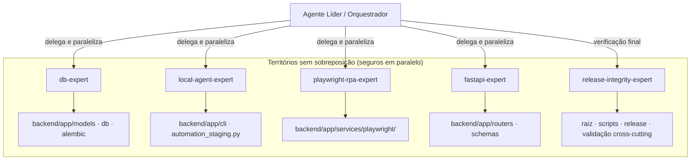

# 🤖 Stellantis Automation HUB — Catálogo de Agentes e Skills

Este documento é o registro oficial dos **subagentes Claude Code** especializados do **Automation HUB**.
Eles são definidos em [.claude/agents/](.claude/agents/) e o orquestrador (o agente líder) os aciona — em
paralelo quando os territórios não se sobrepõem — para auditar, manter e evoluir o sistema com isolamento
de escopo e máxima qualidade técnica.

> Estes são agentes reais e executáveis pelo Claude Code, não um catálogo conceitual. Cada arquivo `.md`
> em `.claude/agents/` carrega `name`, `description` (usada pelo líder para rotear a delegação), `tools`
> (escopo de ferramentas), `model` e o system prompt com o conhecimento de domínio.

---

## 🧭 Modelo de orquestração (como o líder trabalha)

1. **O líder não implementa** — interpreta o pedido, decide quais especialistas entram e delega.
2. **Paralelização por território**: db / cli / playwright / fastapi mexem em diretórios disjuntos, então
   rodam em paralelo sem conflito de merge. Tarefas com dependência de contrato (ex.: novo campo de payload
   que atravessa agente↔API) são sequenciadas ou explicitamente alinhadas entre os dois agentes.
3. **`release-integrity-expert` fecha o ciclo**: roda por último a verificação integradora (compileall,
   pytest, alembic current, auditoria de release) e dá o veredito.
4. Cada especialista **reporta de volta ao líder**: arquivos tocados, mudanças de contrato, riscos e
   validações executadas. O líder consolida para o usuário.

---

## 🛠️ Catálogo de Agentes

### 1. 📊 `db-expert` — Banco de Dados, Modelos e Migrações
*   **Arquivo:** [.claude/agents/db-expert.md](.claude/agents/db-expert.md) · **Modelo:** sonnet
*   **Território:** `backend/app/models/`, `backend/app/db/`, `backend/alembic/`, `backend/app/schemas/` (quando acompanha modelo).
*   **Competências:**
    *   Isolamento dual-environment: engines/session factories por-ambiente e cacheados; nunca engine global.
    *   Migrações Alembic com `AUTOMATION_HUB_MIGRATION_ENVIRONMENT`, upgrade **e** downgrade, em ambos os bancos.
    *   `batch_alter_table` para alterar restrições/colunas no SQLite sem corromper schema; compatibilidade PostgreSQL.
    *   Pragmas SQLite (`WAL`, `busy_timeout`); fidelidade ao contrato real de tabelas (sem `automation_executions`).

### 2. 📁 `local-agent-expert` — Agente Local CLI e Staging
*   **Arquivo:** [.claude/agents/local-agent-expert.md](.claude/agents/local-agent-expert.md) · **Modelo:** sonnet
*   **Território:** `backend/app/cli/local_agent.py`, `backend/app/services/automation_staging.py`.
*   **Competências:**
    *   Loop dual-environment, heartbeat/polling, ciclo `start → complete|fail|manual-review|cancel`, logs estruturados.
    *   Assinatura SHA256 e **dedup persistente** via baseline (hash exato + fallback por mtime); classificação new/updated/audit_duplicate.
    *   Staging em lotes `lote_NNN`, normalização cross-platform de caminhos, checkpoints idempotentes de lote.
    *   Orquestração de conversão PDF e reenvio; preservação do temp para auditoria.

### 3. 🌐 `playwright-rpa-expert` — Automação Web (Playground)
*   **Arquivo:** [.claude/agents/playwright-rpa-expert.md](.claude/agents/playwright-rpa-expert.md) · **Modelo:** sonnet
*   **Território:** `backend/app/services/playwright/`.
*   **Competências:**
    *   Contexto Chromium persistente por usuário; Chromium offline 1217 via `PLAYWRIGHT_BROWSERS_PATH`; login manual/SSO.
    *   Seletores multilíngues (PT/EN); confirmação **real** de upload (rede 2xx de arquivo OU verde pós-clique), sem falso positivo.
    *   Delete verificado por F5 (sem reenvio não confirmado → sem duplicação); conversão PDF MS Office (COM) → LibreOffice.
    *   Autorrecuperação em dois níveis e isolamento híbrido de arquivo corrompido; screenshots de erro.

### 4. 🔐 `fastapi-expert` — Endpoints, Schemas e Protocolo do Agente
*   **Arquivo:** [.claude/agents/fastapi-expert.md](.claude/agents/fastapi-expert.md) · **Modelo:** sonnet
*   **Território:** `backend/app/routers/`, `backend/app/schemas/`, `backend/app/main.py`.
*   **Competências:**
    *   Auth: `AUTH_DISABLED` + admin local; `require_agent_or_user` com `compare_digest` (timing-safe); mapeamento protected/agent_protected.
    *   Mitigação de vazamento (sem `password_hash` em respostas); middleware de ambiente por request.
    *   Ciclo de vida de `AgentTask` (poll/start/complete/fail/manual-review/cancel/batch-complete/log) e `maybe_finalize_automation`.
    *   Serialização para o dashboard (`sao_paulo_utc_iso`); alinhamento de contrato com o agente local.

### 5. 🏗️ `release-integrity-expert` — Integridade e Release Offline
*   **Arquivo:** [.claude/agents/release-integrity-expert.md](.claude/agents/release-integrity-expert.md) · **Modelo:** opus
*   **Território:** raiz, `scripts/`, `.bat`, `requirements*`, `.env.example`, docs; leitura cross-cutting de `backend/app`.
*   **Competências:**
    *   Gate de validação: `compileall`, `pytest`, `alembic current`, `npm run build`.
    *   Sanitização do pacote (RELEASE_POLICY.md): zero `.db`/logs/sessões/testes/seeds/`src`/`.venv` no ZIP.
    *   Auditoria de invariantes arquiteturais (isolamento dual-env, sem segredo vazado, Chromium offline).
    *   Verificação integradora após delegação paralela; veredito **PRONTO PARA RELEASE** ou lista de bloqueios.

---

## ➕ Como adicionar/alterar um agente

1. Crie/edite o `.md` em [.claude/agents/](.claude/agents/) com `name`, `description`, `tools`, `model` e o system prompt.
2. A `description` deve dizer **quando** o líder aciona o agente e **quando não** — é o que roteia a delegação.
3. Mantenha territórios disjuntos para preservar a paralelização segura. Dependências de contrato entre
   camadas devem ser declaradas no prompt para o líder sequenciar.
4. Registre a mudança aqui neste catálogo.

---

*Catálogo migrado para subagentes Claude Code reais, alinhado ao código atual do Automation HUB.*
