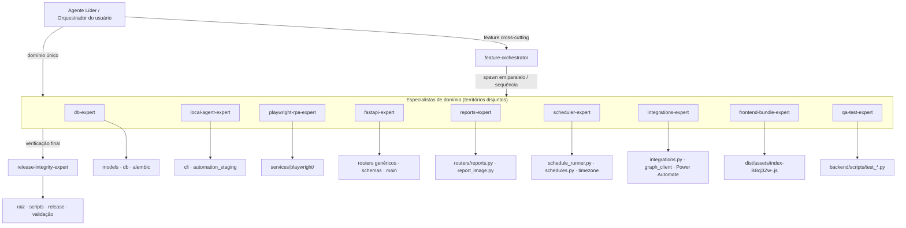

# 🤖 Stellantis Automation HUB — Catálogo de Agentes e Skills

Este documento é o registro oficial dos **subagentes Claude Code** especializados do **Automation HUB**.
Eles são definidos em [.claude/agents/](.claude/agents/) e o orquestrador (o agente líder) os aciona — em
paralelo quando os territórios não se sobrepõem — para auditar, manter e evoluir o sistema com isolamento
de escopo e máxima qualidade técnica.

> Estes são agentes reais e executáveis pelo Claude Code, não um catálogo conceitual. Cada arquivo `.md`
> em `.claude/agents/` carrega `name`, `description` (usada pelo líder para rotear a delegação), `tools`
> (escopo de ferramentas), `model` e o system prompt com o conhecimento de domínio.
>
> *Time atual: **11 agentes** (9 especialistas de domínio + 1 orquestrador de feature + 1 gate de release).
> Atualizado em 2026-07-15.*

---

## 🧭 Modelo de orquestração (como o time trabalha)

1. **O líder não implementa** — interpreta o pedido, decide quais especialistas entram e delega.
2. **Domínio único → especialista direto.** Pedido dentro de um só território? O líder aciona o especialista
   dono daquele território.
3. **Cross-cutting → `feature-orchestrator`.** Pedido que atravessa vários territórios? O líder entrega ao
   `feature-orchestrator`, que **decompõe, spawna os especialistas (subagentes) e coordena** — é o agente que
   "cria subagentes para trabalharem em conjunto".
4. **Paralelização por território disjunto.** db / cli / playwright / fastapi / reports / scheduler /
   integrations / frontend / qa mexem em arquivos disjuntos → rodam **em paralelo** sem conflito de merge
   (spawn de vários Task numa única leva). **Territórios sobrepostos nunca vão em paralelo** — são sequenciados.
5. **Dependência de contrato é sequenciada.** Quem define o schema/contrato (ex.: `db-expert` cria a coluna,
   `fastapi-expert` expõe o endpoint) vai **antes** de quem consome (`local-agent-expert`,
   `frontend-bundle-expert`). O contrato exato (nome do campo/endpoint/payload) é escrito no briefing dos dois lados.
6. **`qa-test-expert` prova o comportamento** e **`release-integrity-expert` fecha o ciclo** com a verificação
   integradora (`compileall`, testes, `alembic current`, auditoria de release) e o veredito.
7. Cada especialista **reporta de volta**: arquivos tocados, mudanças de contrato, riscos e validações. O
   orquestrador/líder consolida para o usuário.

> **Nota sobre subagentes aninhados:** `feature-orchestrator`, `reports-expert`, `integrations-expert` e
> `qa-test-expert` têm a ferramenta `Task` e podem spawnar teammates. Se a versão do Claude Code em uso não
> permitir spawn aninhado, o agente degrada para um **plano de delegação ordenado** e devolve ao líder para
> executar os Task — a lógica de paralela/sequência permanece idêntica.

---

## 🛠️ Catálogo de Agentes

### Especialistas de domínio

#### 1. 📊 `db-expert` — Banco de Dados, Modelos e Migrações · sonnet
*   **Território:** `backend/app/models/`, `backend/app/db/`, `backend/alembic/`, `schemas/` (quando acompanha modelo).
*   Isolamento dual-environment (engines por-ambiente, nunca global); migrações Alembic (upgrade+downgrade, os 2 bancos);
    `batch_alter_table` no SQLite; pragmas WAL; contrato real de tabelas (sem `automation_executions`).

#### 2. 📁 `local-agent-expert` — Agente Local CLI e Staging · sonnet
*   **Território:** `backend/app/cli/local_agent.py`, `backend/app/services/automation_staging.py`.
*   Loop dual-environment, heartbeat/polling, ciclo `start→complete|fail|manual-review|cancel`; dedup SHA256/mtime
    (baseline); staging em `lote_NNN`; checkpoints idempotentes; orquestração de conversão/reenvio PDF.

#### 3. 🌐 `playwright-rpa-expert` — Automação Web (Playground) · sonnet
*   **Território:** `backend/app/services/playwright/`.
*   Contexto Chromium persistente por usuário (offline 1217); seletores multilíngues; confirmação **real** de upload
    (sem falso positivo); delete verificado por F5; conversão PDF (Office COM → LibreOffice); autorrecuperação.

#### 4. 🔐 `fastapi-expert` — Endpoints, Schemas e Protocolo do Agente · sonnet
*   **Território:** `backend/app/routers/` (genéricos), `schemas/`, `main.py`, `audit.py`.
    **Carve-outs:** reports/schedules/integrations têm dono próprio (você mantém só o registro/proteção deles em `main.py`).
*   Auth (`AUTH_DISABLED` + admin local; `require_agent_or_user` timing-safe); anti-vazamento; ciclo de vida de
    `AgentTask` e `maybe_finalize_automation`; serialização `sao_paulo_utc_iso`.

#### 5. 📈 `reports-expert` — Relatórios e Card do Teams · sonnet · **+Task**
*   **Território:** `backend/app/routers/reports.py`, `backend/app/services/report_image.py`.
*   Blocos de relatório e export XLSX/PDF/CSV; **1 run = 1 execução** (`block_executions`); card de adoção + card-IMAGEM
    (PNG via Chromium offline, render em thread) com fallback; `persist_report` + entrega opt-in do Simplificado.
    Pode spawnar `frontend-bundle-expert` para a parte do dashboard.

#### 6. ⏰ `scheduler-expert` — Agendador e Agendamentos · sonnet
*   **Território:** `backend/app/services/schedule_runner.py`, `backend/app/routers/schedules.py`, `core/timezone.py`.
*   Loop asyncio dual-environment; frequências once/interval/daily/weekly/monthly; cálculo idempotente de `next_run_at`
    em fuso São Paulo; disparo de automações e de relatórios (`run_due_report_schedule` + toggle `deliver_to_folder`).

#### 7. 📨 `integrations-expert` — MS Graph e Power Automate/Teams · sonnet · **+Task**
*   **Território:** `backend/app/routers/integrations.py`, `backend/app/services/integrations/graph_client.py`, `GUIA_POWER_AUTOMATE.md`.
*   Envio e-mail/Teams/calendário (app-only MSAL); `IntegrationDelivery` (pending→sent/failed/not_configured);
    sanitização de segredos; entrega por pasta (`REPORT_DELIVERY_PATH`) e Teams deep link. Fallback gracioso sempre.
    Pode spawnar `frontend-bundle-expert` para botões/deep link do dashboard.

#### 8. 🖥️ `frontend-bundle-expert` — Bundle React/Vite Pré-compilado · sonnet
*   **Território:** `dist/assets/index-BBcj3Zw-.js` (bundle minificado, sem fonte no repo).
*   Backup `.bak` antes de editar; **sempre** `Oe`/`kt` (propagam `X-App-Environment`), nunca `fetch` cru; mudanças
    auto-contidas com branch explícito de handler; validação por `node --check` numa cópia `.mjs`; padrões visuais.

#### 9. ✅ `qa-test-expert` — Testes e Validação Funcional · sonnet · **+Task**
*   **Território:** `backend/scripts/test_*.py` (suíte real; não há `backend/tests/` nem pytest configurado).
*   Cobre sem-duplicata, reenvio/recuperação PDF, 1-run-1-execução, card do Teams, entrega agendada, recuperação de
    login. Nunca relaxa asserção para mascarar bug. Pode spawnar o expert de domínio para esclarecer a regra esperada.

### Coordenação

#### 10. 🧩 `feature-orchestrator` — Orquestrador de Feature Cross-cutting · opus · **+Task**
*   Decompõe pedidos que atravessam vários territórios, **spawna os especialistas em paralelo/sequência**, escreve o
    contrato compartilhado nos dois lados, integra e reconcilia, e fecha pelo gate de release. É o agente do
    "criem subagentes para trabalharem em conjunto".

#### 11. 🏗️ `release-integrity-expert` — Integridade e Release Offline · opus
*   **Território:** raiz, `scripts/`, `.bat`, `requirements*`, `.env.example`, docs; leitura cross-cutting de `backend/app`.
*   Gate final: `compileall`/testes/`alembic current`/`npm run build`; sanitização do pacote (RELEASE_POLICY.md);
    auditoria de invariantes arquiteturais; veredito **PRONTO PARA RELEASE** ou lista de bloqueios.

---

## ➕ Como adicionar/alterar um agente

1. Crie/edite o `.md` em [.claude/agents/](.claude/agents/) com `name`, `description`, `tools`, `model` e o system prompt.
2. A `description` deve dizer **quando** o líder aciona o agente e **quando não** — é o que roteia a delegação.
   Inclua `Task` em `tools` só se o agente realmente precisa spawnar teammates.
3. Mantenha territórios **disjuntos** (nível de arquivo) para preservar a paralelização segura. Dependências de
   contrato entre camadas devem ser declaradas no prompt para o orquestrador sequenciar.
4. Registre a mudança aqui neste catálogo (lista + diagrama).

---

*Catálogo de subagentes Claude Code reais, alinhado ao código atual do Automation HUB (ver também `SPECS.md` e `PDR.md`).*
