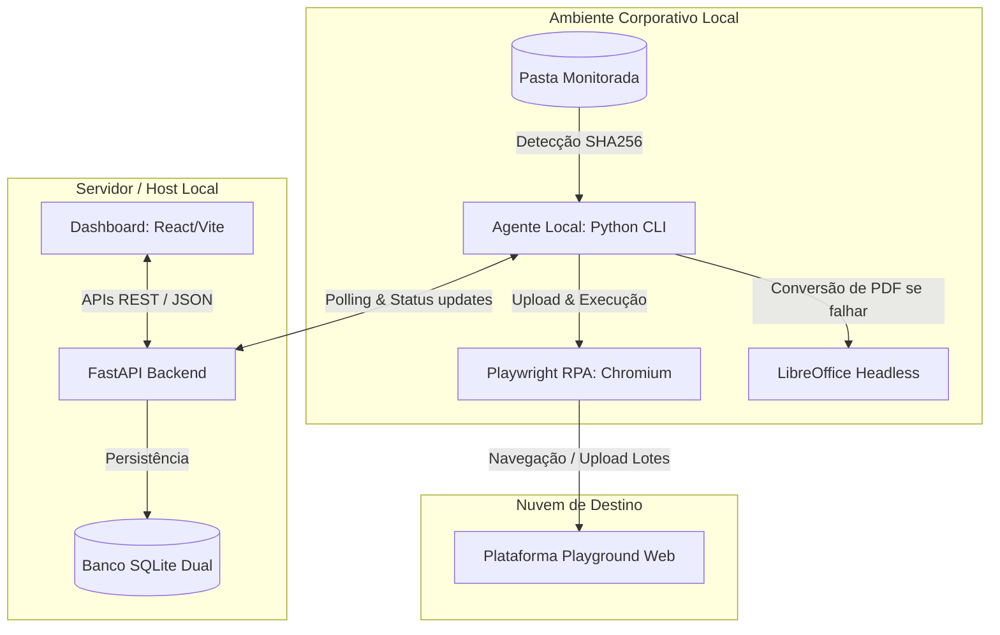
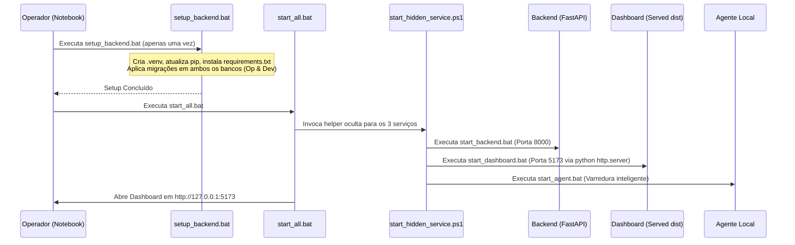

# 🚀 Stellantis Automation HUB - ANTIGRAVITY Guide

Bem-vindo ao **Automation HUB**, uma plataforma corporativa avançada de orquestração e execução de automações robóticas (RPA) integrada com a inteligência do sistema **Playground**. 

Este documento (`ANTIGRAVITY.MD`) serve como o manual definitivo do desenvolvedor, operador e do assistente de IA (**Antigravity**). Ele fornece um mapeamento detalhado da arquitetura, fluxo operacional, isolamento de ambientes e diretrizes de desenvolvimento do projeto.

---

## 🏗️ 1. Arquitetura do Sistema e Componentes

O **Automation HUB** é composto por três blocos perfeitamente integrados que cooperam para orquestrar arquivos locais e interações web inteligentes:



### 🔹 Componente A: Backend (FastAPI & SQLAlchemy)
*   **Finalidade:** Central de inteligência. Controla os estados de execução, tabelas de controle, agendamentos e serve APIs REST para o frontend.
*   **Principais Bibliotecas:** FastAPI, SQLAlchemy com Alembic para migrações, Uvicorn, MSAL para integrações MS Graph.
*   **Dual-Environment:** Utiliza `ContextVars` do Python para isolar dinamicamente os escopos de banco de dados e diretórios para os modos **Operacional** e **Desenvolvedor**.

### 🔹 Componente B: Agente Local (Python CLI)
*   **Finalidade:** Serviço de background executado na máquina local. Faz varreduras na pasta monitorada, calcula hashes SHA256, deduplica arquivos e envia relatórios e dados estruturados para o Backend.
*   **Localização:** `backend\app\cli\local_agent.py`

### 🔹 Componente C: RPA com Playwright & Chromium
*   **Finalidade:** Automatiza interações na interface da plataforma Playground. Abre instâncias de browser, preenche dados, seleciona workspaces, gerencia o login e valida o status de processamento da ingestão.
*   **Localização:** `backend\app\services\playwright\`
*   **Tratamento de Erros:** Conversão local secundária via LibreOffice Headless (`soffice`) quando o upload ou formatação original for incompatível.

---

## 🔒 2. Isolamento de Ambientes (Modo Operacional vs. Desenvolvedor)

O Automation HUB utiliza um sistema dinâmico de roteamento de ambiente baseado no cabeçalho HTTP `X-App-Environment`.

> [!IMPORTANT]
> A separação garante que execuções de teste do Desenvolvedor não alterem bancos de dados operacionais, caminhos de logs, relatórios ou cookies de sessões de browser reais.

### 📊 Tabela de Mapeamento de Caminhos e Variáveis

| Configuração / Diretório | Modo Operacional (Default) | Modo Desenvolvedor (`developer` / `dev`) |
| :--- | :--- | :--- |
| **Banco de Dados SQLite** | `./data/automation_hub_dev.db` (ou `OPERATIONAL_DATABASE_URL`) | `./data/developer/automation_hub_dev.db` (ou `DEVELOPER_DATABASE_URL`) |
| **Sessões de Navegador** | `./data/browser_session` | `./data/developer/browser_session` |
| **Logs de Sistema** | `./data/logs` | `./data/developer/logs` |
| **Relatórios Locais** | `./data/reports` | `./data/developer/reports` |
| **Capturas de Tela (Erros)**| `./data/screenshots/errors` | `./data/developer/screenshots/errors` |
| **Arquivos Temporários** | `./data/temp` | `./data/developer/temp` |
| **Fotos de Perfil** | `./data/profile_photos` | `./data/developer/profile_photos` |

### 🛠️ Mecanismo Interno (`backend\app\core\config.py`)
O backend intercepta as requisições, detecta o ambiente e define o escopo do banco usando a biblioteca `ContextVar`:
```python
_environment_context: ContextVar[str] = ContextVar("automation_hub_environment", default="operational")
```
Para as migrações, a variável de ambiente `AUTOMATION_HUB_MIGRATION_ENVIRONMENT` decide qual banco de dados é o alvo do Alembic durante o setup.

---

## 📦 3. Política de Release Offline Corporativo

A distribuição para notebooks corporativos é altamente controlada para evitar dependências de download e proteger a estabilidade do sistema.

> [!WARNING]
> **Regra de Ouro da Release:** Não empacotar bancos `.db`, logs, caches `__pycache__`, sessoes ativas, seeds de testes ou a pasta `src` do frontend. Apenas o `dist` buildado é fornecido.

### 🚫 Conteúdos Estritamente Proibidos na Release
*   Arquivos de desenvolvimento/testes: `backend\tests`, `backend\requirements-dev.txt`, `src` (frontend source).
*   Dados de sessão e runtime: `backend\data\*.db`, logs, screenshots, arquivos temporários de conversão.
*   Bibliotecas virtuais locais: `.venv`, `node_modules`, `.idea`.

### ✅ Conteúdos Permitidos / Incluídos
*   Frontend compilado pronto para produção: `dist`
*   Assets estáticos de interface: `public`
*   Core Python: `backend\app` e `backend\alembic`
*   Navegador Embarcado: `backend\ms-playwright` (Chromium v1217 offline) para contornar bloqueios de proxy corporativo.
*   Scripts utilitários: `.bat` de automação de serviços.

---

## ⚙️ 4. Fluxo de Setup e Inicialização

O sistema roda inteiramente em Windows através de scripts `.bat` otimizados.



### 💻 Scripts Principais

1.  **`setup_backend.bat`**:
    *   Cria o `.venv` virtual.
    *   Instala as dependências de produção do `backend\requirements.txt`.
    *   Aplica migrações para os bancos **Operacional** e **Desenvolvedor** usando Alembic.
    *   Ignora download do Chromium se já estiver no cache offline (`backend\ms-playwright`).
2.  **`start_all.bat`**:
    *   Orquestra a inicialização em modo oculto dos três serviços fundamentais: FastAPI, Simple Dashboard Server (`python -m http.server`), e Agente CLI.
    *   Utiliza o wrapper PowerShell `scripts\start_hidden_service.ps1` para redirecionar logs e ocultar janelas de terminal.
3.  **`restart_services.bat`**:
    *   Encerra exclusivamente os processos associados ao Automation HUB para evitar interrupções de outros apps e realiza uma reinicialização limpa em janelas ocultas.
4.  **`start_backend.bat`, `start_dashboard.bat`, `start_agent.bat`**:
    *   Chamadores específicos individuais que configuram variáveis dinâmicas e caminhos (`PLAYWRIGHT_BROWSERS_PATH`, etc.) de forma transparente.

---

## 🔍 5. Monitoramento de Pastas & Relatórios

O **Agente Local** é extremamente robusto no manuseio de arquivos:
*   **Comparação Inteligente:** Baseado no hash SHA256 do arquivo para evitar re-uploads redundantes.
*   **Envio por Lotes:** Agrupa arquivos em lotes de tamanho parametrizável (`UPLOAD_BATCH_SIZE`, padrão `5`) com intervalos de segurança para não travar a API.
*   **Fallback PDF Inteligente:** Se a leitura e o upload direto de planilhas/documentos específicos falhar no Playground, o agente tenta invocar a conversão local para PDF via executável headless do LibreOffice antes de marcar o upload como falhado.

### 📋 Relatórios Locais de Execução
Gerados de forma manual ou automática a cada ciclo de scan:
1.  **Relatório Geral:** Resumo estatístico do ciclo em XLSX.
2.  **Relatório Arquivos:** Logs individuais detalhando hash, status e caminho físico dos arquivos tratados.
3.  **Relatório Erros Locais:** Log detalhado de falhas de I/O locais ocorridas antes do upload web.

> [!TIP]
> **Limpeza de Relatórios Legados:**
> Se o sistema estiver com arquivos de relatórios antigos ocupando muito espaço, execute a limpeza manual:
> ```powershell
> cd backend
> .\.venv\Scripts\python.exe -m app.cli.purge_legacy_reports --apply
> ```

---

## 🌐 6. Integração Playwright Web

A automação do Playground é modularizada sob a pasta `backend\app\services\playwright\`:
*   `playground_login.py`: Gerencia sessões ativas e retém cookies no caminho `./data/browser_session` (ou `./data/developer/browser_session`).
*   `playground_upload.py`: Controla o upload em lotes e interage com os campos complexos de formulário.
*   `playground_workspace.py`: Sincroniza e cria estruturas de workspaces no Playground baseados nas configurações locais.

### 🔍 Configurações Importantes do Playwright
*   **Modo Headless (`PLAYWRIGHT_HEADLESS=false`):** Por padrão nas releases corporativas, a janela do navegador abre visível para que o usuário possa fazer o login manualmente ou monitorar visualmente o robô se necessário.
*   **Timeout Padrão (`PLAYWRIGHT_DEFAULT_TIMEOUT=30000`):** Limite de 30 segundos para busca de elementos na interface web.

---

## 📑 7. Mapa de Endpoints REST API

Abaixo estão os endpoints chave que a IA ou o Desenvolvedor devem usar para depuração ou consumo:

### 🔓 Públicos
*   `GET /health` | `GET /api/health` — Status operacional da API
*   `POST /api/auth/login` — Autenticação tradicional e geração de JWT

### 🔐 Autenticados (JWT Bearer / X-Agent-Token)
*   `GET /api/auth/me` — Detalhes do usuário logado
*   `GET /api/users` — Gerenciamento de administradores e operadores
*   `GET /api/workspaces` — Integração de workspaces locais e remotos
*   `GET /api/logs` | `/api/reports` — Histórico de execução de auditoria e logs estruturados
*   `GET /api/schedules` — Listagem e disparo manual de automações agendadas
*   `GET /api/executions` — Resumos gerais das tarefas em andamento

### 🤖 Autenticação do Agente Local CLI
O agente local se autentica e polling a fila de tarefas enviando a chave de segurança definida em `AGENT_SHARED_TOKEN` como cabeçalho `X-Agent-Token` ou Bearer Token tradicional:
*   `GET /api/agents/poll` — Polling de novas tarefas da fila
*   `POST /api/agents/tasks/{id}/start` — Marca início da tarefa
*   `POST /api/agents/tasks/{id}/complete` — Finaliza com sucesso
*   `POST /api/agents/tasks/{id}/fail` — Finaliza com erro
*   `POST /api/agents/tasks/{id}/log` — Envia blocos de logs gerados localmente para o servidor central

---

## ✅ 8. Guia de Validação e Desenvolvimento Local

Para desenvolvedores modificando este projeto na máquina local de desenvolvimento:

### 🧪 Preparando Dependências de Desenvolvimento
```powershell
cd backend
.\.venv\Scripts\python.exe -m pip install -r requirements-dev.txt
```

### 🛠️ Validação Completa de Integridade (Antes de criar Releases)
Execute a suite de testes locais, compile os códigos e valide as migrações:

1.  **Testes unitários / Integração:**
    ```powershell
    cd backend
    .\.venv\Scripts\python.exe -m pytest tests -q
    ```
2.  **Validação de Migrações do Banco:**
    ```powershell
    .\.venv\Scripts\python.exe -m alembic current
    ```
3.  **Compilação estática de verificação:**
    ```powershell
    cd ..
    .\backend\.venv\Scripts\python.exe -m compileall backend\app
    ```
4.  **Buildando Pacote de Release ZIP:**
    ```powershell
    .\build_release_empty_db.bat
    ```

---

*Manual estruturado e adaptado para o Automation HUB em 27 de Maio de 2026.*
